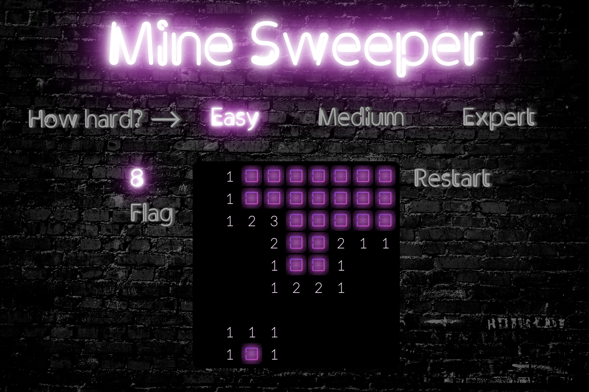
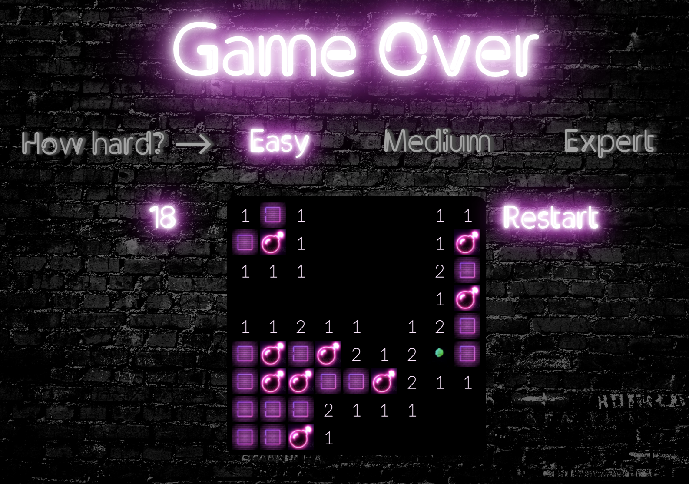

# General Assembly Project One - Minesweeper

## Timeframe
1 week

## Goal:
To build a functioning browser game using vanilla JavaScript.

## Project Overview
This was my first project for the Software Engineering Immersive course. It is a 2D, single-player game based on the classic Windows PC game Minesweeper. The objective is to clear a board containing hidden mines without detonating them. The player needs to decide which tiles have mines hidden underneath based on numbered clues hidden under the remaining tiles. If the player clicks on a tile that a mine is under, the game is immediately over and the board is cleared to reveal the location of all mines. If the player manages to work out where all mines are located without actually clicking on them, they clear the board and can move on to another level.

### Play deployed version
https://jacquelinedeleeuw.github.io/sei-project-one/


### Project Brief
- The game should be playable for one player, playing against the computer
- The board should be automatically cleared when a mine is clicked
- Surrounding blank cells should automatically clear when a blank cell is clicked
- Include separate HTML, CSS and JavaScript files
- Deploy the game online

### Technologies used:
- HTML5 with HTML5 audio
- CSS3 with animation
- JavaScript (ES6)
- Git
- GitHub
- Google Fonts
- Google Chrome Dev Tools
- Eslint

### Process
I started by pseudocoding all elements of the game as described in the project brief. Once I had a broad overview I worked on the different elements one at a time starting with creating the grid with each cell part of the grid array for a 9 x 9 game.

In order to create a truly random minefield I used a separate function to shuffle the mines. 
```
for (let i = 0; i < randomMines.length; i++) {
 const j = Math.floor(Math.random() * (i + 1))
 const temp = randomMines[i]
 randomMines[i] = randomMines[j]
 randomMines[j] = temp
}
```

After this the cells were added to the grid.

I added an event listener to each of the cells so the user could interact by clicking to open the cells. To be able to use the right click function for flagging the cells I had to prevent the default menu that pops up when you right click content and make sure the cells were not clickable if they were flagged.

To generate the numbers on cells indicating how many mines are in the surrounding cells I wrote a function that loops through each of the cells in the array and tests each surrounding cell individually. If a surrounding cell contains a mine, 1 would be added to the value displayed on the uncovered cell.

```
function numberLogic() {
   if (grid.classList.contains('mediumGame')) {
     width = 16
     height = 16
     cellCount = width * height
   } else if (grid.classList.contains('hardGame')) {
     width = 16
     height = 30
     cellCount = width * height
   }
   for (let i = 0; i < cellCount; i++) {
     const left = i - 1
     const right = i + 1
     const top = i - width
     const bottom = i + width
     const leftTop = i - 1 - width
     const rightTop = i + 1 - width
     const leftBottom = i - 1 + width
     const rightBottom = i + 1 + width
     if (cells[i].classList.contains('mine')) {
       cells[i].value = 0
     } else {
       if (i % width !== width - 1 && cells[right].classList.contains('mine')) {
         cells[i].value += 1
       }
       if (i % width !== 0 && cells[left].classList.contains('mine')) {
         cells[i].value += 1
       }
       if (i >= width && cells[top].classList.contains('mine')) {
         cells[i].value += 1
       }
       if (i < cellCount - width && cells[bottom].classList.contains('mine')) {
         cells[i].value += 1
       }
       if (i % width !== 0 && i >= width && cells[leftTop].classList.contains('mine')) {
         cells[i].value += 1
       }
       if (i % width !== width - 1 && i >= width && cells[rightTop].classList.contains('mine')) {
         cells[i].value += 1
       }
       if (i % width !== 0 && i < cellCount - width && cells[leftBottom].classList.contains('mine')) {
         cells[i].value += 1
       }
       if (i % width !== width - 1 && i < cellCount - width && cells[rightBottom].classList.contains('mine')) {
         cells[i].value += 1
       }
     }
   }
 }
```


When a player clicks a blank cell, all surrounding blank cells should open up automatically until they reach a number. In order to implement this I had to create a loop to check all surrounding cells, open them up including the first number that surrounds the clicked cell at which point the loop for that side would finish. This was one of the biggest challenges for me and something I got stuck on for quite a while. After thorough testing and 

```
if (testBlankCell % width !== 0 && cells[testBlankCell - 1].classList.contains('safe') && !alreadyChecked.includes(testBlankCell - 1) && testLeft === true && !cells[testBlankCell - 1].classList.contains('flagged')) {
 cells[testBlankCell - 1].classList.add('uncovered')
 if (cells[testBlankCell - 1].value > 0) {
   cells[testBlankCell - 1].innerHTML = cells[testBlankCell - 1].value
 } else {
   testBlankCells.push(testBlankCell - 1)
 }
 alreadyChecked.push(testBlankCell - 1)
} else {
 testLeft = false
}
```

After the game was at MVP, I created a medium and hard level. By using the width and height in the number of cells as parameters the functions for creating the grid and generating the mines.

A feature I really wanted to include was that the first click would never be a mine. After trying many other options I accomplished this by adding 3 safe cells at the end of the array after the cells were shuffled. If the player would click on a mine on the first click, it would trigger a function to switch the mine with one of the last 3 cells making sure it would always be a safe cell.



When playing some different versions of minesweeper to check if I had missed any features, I found that some newer versions of minesweeper also provide the option to navigate with the arrows on the keyboard and control/space to flag/reveal cells. I included this as a (hidden) feature on the game where the border around the cell that is selected only appears after the arrows are used so the design of the board is not disturbed when the player chooses to use their mouse instead.

### Future improvements
I made the game on a large screen and even though I ensured it was a little responsive and suitable to play on a tablet, it would still need to be updated to work better on different sizes of phones.

### Key Learnings
I learned a lot making this game and was able to combine everything I had learned over the previous weeks about HTML, CSS and JavaScript. I made sure to be very thorough in my planning and worked on one component at a time to make sure one thing worked before moving onto the next. The function to open all surrounding blank cells was the biggest challenge for me and I learned that stepping away from my computer for a bit and coming back to a problem later can make a big difference.

 
 

